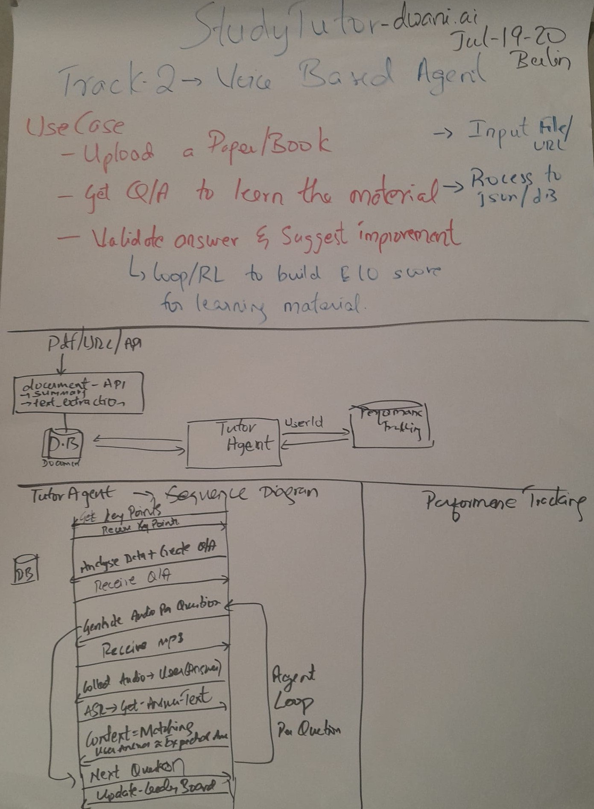

notebooklm - StudyTutor

 

> Voice Interaction for Learning from a Research Paper / Directory

- Tools
  - dwani.ai - Document extraction, Speech Generation, Q/A creation
  - aicoustics for - Speech modulation
  - Whisper + openai Spec : for Data manipulation via prompts using vLLM

### Install all libraries
```bash
pip install -r requirements
```

### Setup the credentials
```bash
export DWANI_API_KEY='your_api_key_here'
export DWANI_API_BASE_URL='https://api.example.com'
export SOUND_API_KEY='api-key-for-ai-coustcs'
export VLLM_IP="vllm_ip_with_openai"
```

- python directory_extract.py

- python plan_creator.py

- python enhance_audio.py


<!-- 

https://techeurope.notion.site/berlin-hackathon-manual

-->

